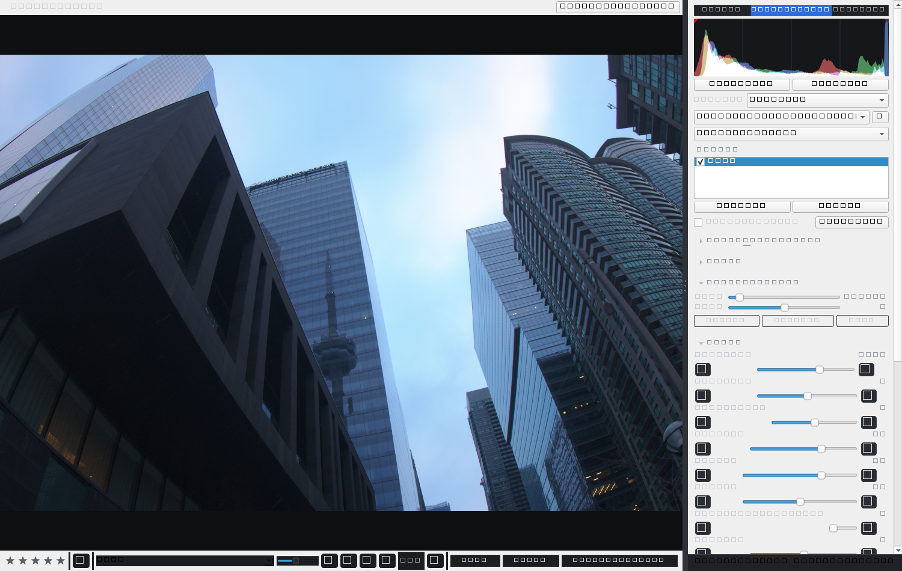
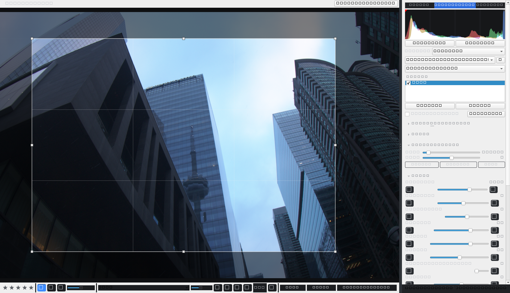
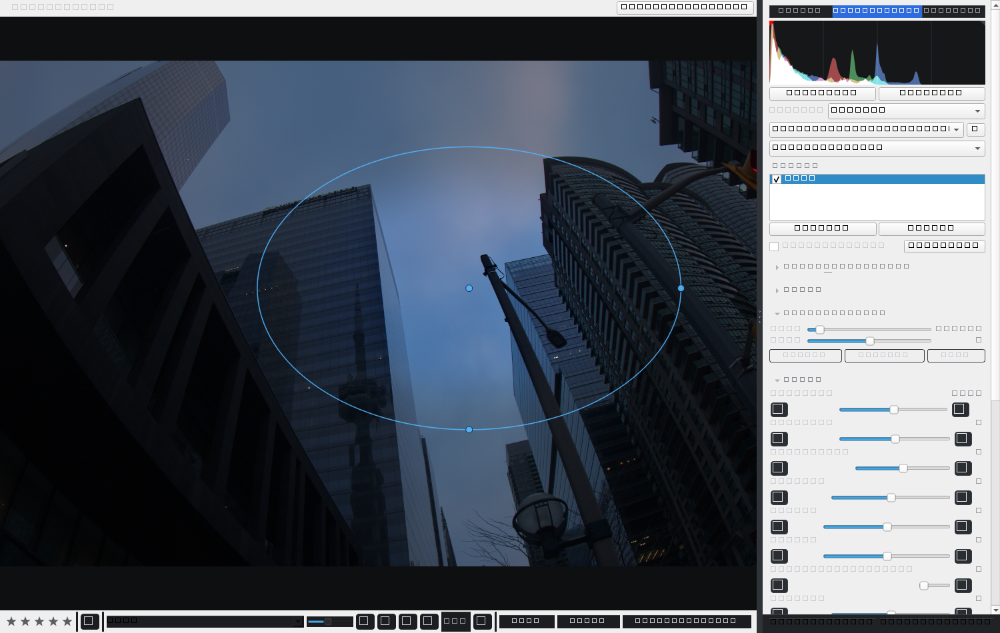

<div align="center">

# Vibe Photo

**A fast, non-destructive RAW photo editor and catalog manager for the desktop.**

Develop the RAW, not a JPEG. Layered, local, non-destructive edits on a headless
processing core — with a responsive, resizable UI.

[](LICENSE)


</div>

---

## Screenshots

<div align="center">
  
</div>

| On-canvas crop & straighten | Local-adjustment masks |
| :---: | :---: |
|  |  |

<sub>Developing RAW files from a Toronto shoot — the develop panel, the on-canvas crop tool (handles, rule-of-thirds grid, dimmed surround), and a radial local-adjustment mask drawn on the photo.</sub>

---

## Why Vibe Photo

Most edits you make to a photo are destructive — they bake pixels. Vibe Photo keeps
your entire edit as **data**: a stack of adjustment layers, local masks, crop, and a
creative profile, all stored separately from the image. The same resolution-independent
pipeline drives both the live preview and the final export, so what you see is what you
get. RAW files are demosaiced to **16-bit scene-linear light**, so exposure and tone
behave photographically and highlights keep real headroom — you are developing the
RAW, not editing a flattened preview.

The whole processing engine and catalog are **headless**: they never import the UI, so
they run in CI, on a server, or in a batch job without a display.

## Features

### RAW develop
- **Scene-linear pipeline** — 16-bit linear demosaic; white balance, exposure, and tone
  run in linear light, then a filmic base tone-map renders to display.
- **Per-camera white balance** — Temperature (Kelvin) + Tint with an eyedropper,
  calibrated to each camera's as-shot illuminant.
- **Highlight recovery** — clipped-channel reconstruction at decode and in the pipeline,
  so blown skies resolve cleanly instead of smearing colour.
- **Creative profiles** — ten base looks (Neutral, Standard, Vivid, Portrait, Landscape,
  Flat, Matte, Warm/Cool Film, Monochrome) applied beneath every adjustment.

### Tone, colour & detail
- Exposure, Contrast, Highlights / Shadows / Whites / Blacks.
- Presence: Texture, Clarity, Dehaze; Vibrance / Saturation.
- Parametric **and** point tone curves (RGB + per-channel).
- HSL / B&W mixing and 3-way (+ global) **colour grading**.
- Detail: sharpening (amount/radius/detail/masking) and luminance/colour noise reduction.

### Local adjustments (masking)
- **Radial**, **graduated (linear)**, and **brush** masks — per layer.
- Add and tune masks from the panel, **or draw them directly on the photo**: drag a
  radial's centre/edges, drag gradient endpoints, paint brush strokes.
- Add/subtract mask components; each layer applies only inside its mask.

### Geometry
- **Crop & straighten** — centred aspect-ratio presets plus an on-canvas crop tool
  (drag corners/edges, rule-of-thirds grid, dimmed surround), 90° rotation, and a
  straighten slider, all from the image footer.

### Lens corrections (manual)
- Distortion (barrel/pincushion), chromatic-aberration defringe, and vignetting — pure
  geometry, no lens-profile database required.

### Library & export
- Catalog indexing, thumbnails, ratings/flags, and metadata on an embedded database.
- Import develop presets in the common XMP and legacy Lua-table sidecar formats.
- Colour-managed export to **JPEG / PNG / 16-bit TIFF** with an embedded sRGB ICC
  profile, plus resize and watermark presets.

### Workflow & performance
- Non-destructive **adjustment layers**; toggle any layer to compare.
- **One-click Auto** tone and a single-image HDR look, computed per photo.
- **Smart-preview editing** — a low-resolution draft renders live while you drag
  (skipping the expensive blur stages), then a crisp full-resolution frame lands once the
  edit settles, keeping the UI responsive on large files.
- Copy/paste settings, edit-like-last, full undo/redo, and a **resizable** workspace.

## Install

Requires **Python 3.12+**.

```bash
git clone https://github.com/RenderDeMartes/VibePhoto.git && cd VibePhoto

python -m venv .venv
.venv\Scripts\activate        # Windows
# source .venv/bin/activate   # macOS / Linux

# Headless processing core only:
pip install -e .

# Full desktop app (UI + RAW decoding):
pip install -e ".[ui,raw]"
```

RAW decoding uses LibRaw via `rawpy` (the `raw` extra). Without it the app still runs
and falls back to embedded previews for RAW files.

### Optional extras

| Extra   | Adds                                             |
|---------|--------------------------------------------------|
| `ui`    | The PySide6 desktop application                  |
| `raw`   | RAW decoding (LibRaw / `rawpy`)                  |
| `cv`    | OpenCV-backed computer-vision helpers            |
| `dev`   | Test, lint, and type-check tooling               |
| `build` | PyInstaller, for packaging the desktop app       |

## Run

```bash
python -m vibephoto          # launch the desktop app (needs the [ui] extra)
```

## Build a Windows installer

```bash
pip install -e ".[ui,raw,build]"
python scripts/build_exe.py          # 1) PyInstaller bundle  -> dist/VibePhoto/
python scripts/build_installer.py    # 2) full installer      -> dist/VibePhoto-Setup-<version>.exe
```

`build_installer.py` builds the bundle and then compiles `packaging/VibePhoto.iss` with
the **Inno Setup** compiler (free — install from <https://jrsoftware.org/isdl.php>). The
result is a single `setup.exe` that installs per-user (no admin required) with Start-Menu
and optional desktop shortcuts and a clean uninstaller.

## Architecture

Strictly layered packages. The cardinal rule: **the processing engine and catalog never
import the UI.** Everything below the UI is fully usable headless.

```
UI (PySide6)                 canvas, panels, modules
        |
Application / Services       orchestration, view-models, commands
        |
Catalog - Metadata - Presets - Export        domain layers
        |
Processing engine - RAW decode               pure NumPy, headless
```

The develop pipeline is an ordered, memoizing chain of pure stages: changing one
parameter recomputes only that stage and the ones downstream of it, which is what keeps
slider drags fast. Edit layers compose bottom-to-top over a once-applied crop/straighten.
The full design lives in [`docs/`](docs/).

## Development

```bash
pip install -e ".[ui,raw,dev]"

pytest                 # 349 tests
ruff check src tests   # lint
mypy src               # type-check (strict)
```

The headless test suite runs with no Qt present; GUI tests use the offscreen Qt platform
and are marked `gui`. RAW integration tests run against a tiny synthetic DNG, with an
optional full end-to-end test gated on `VIBEPHOTO_TEST_RAW=<path-to-a-real-raw>`.

## Project layout

```
src/vibephoto/
  processing/    develop pipeline, RAW decode, layers, masks, geometry, lens, profiles
  catalog/       embedded-database catalog, indexer, repositories
  export/        renderers, presets, ICC tagging
  presets/       XMP / Lua-table preset import
  ui/            PySide6 desktop app (canvas, panels, modules)
docs/            architecture and design documents
packaging/       PyInstaller spec + Inno Setup installer script
scripts/         build helpers
tests/           full test suite
```

## Contributing

Issues and pull requests are welcome. Please run `pytest`, `ruff check`, and `mypy`
before submitting. Do **not** commit third-party preset packs, sample RAW files, or any
other content you do not own — `presets/` and common media extensions are git-ignored for
this reason.

## License

Released under the [MIT License](LICENSE). © 2026 Vibe Photo contributors.

This project is an independent work. It is not affiliated with, endorsed by, or derived
from any other photo-editing product, and all trademarks are the property of their
respective owners.
